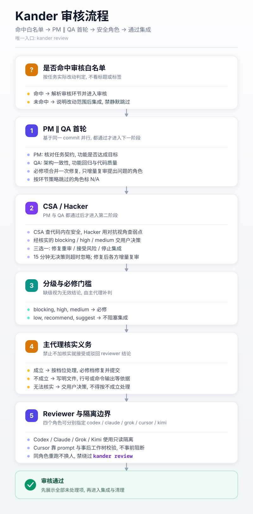

# Kander

一个人用看板调度多个 AI Agent.


## 1. 新手指引

安装完成后即可使用.

4 步上手:

1. 新建一个 Agent 会话, 在里面讨论需求或者任务, 说清楚目标和验收条件. 推荐使用 Agent 的 Plan 模式.
2. 任务确认后, 在该会话里要求 Agent 用看板流程完成任务:

```text
用 kander new 建卡, 完善任务契约并自审后用 kander start 启动
```

3. 有多个需求时, 对每个需求重复步骤 1-2, 不断安排并启动任务.
4. 用命令行界面查看任务状态:

```sh
kander
```

## 2. 安装

需要 Go 1.25+, Git, 以及 Codex, Claude, Grok, Cursor 或 Kimi 中至少一个.

Kimi 有两点与其它 Agent 不同. 其一, kimi-code 的提示词不能由命令行传入, 只能输入到面板, 因此 Kimi 任务必须用 `tmux`, `tmux-session` 或 `herdr` 启动; `console` 与 `foreground` 会被拒绝并说明原因. 其二, kimi-code 首次在一个仓库里启动时会先问是否信任该文件夹, 此时它还不接受输入, kander 会等待超时并提示你去面板里回答一次; 答过之后该仓库不再询问. 另外 Kimi 不接受推理档位: 它没有对应的命令行开关, 档位由 `~/.kimi-code/config.toml` 的 `[thinking] effort` 决定.

拿到 kander 二进制后直接运行即可. 首次启动若尚未安装, 会进入交互向导: 选择界面语言 (`cn`/`en`/`ja`) 与安装位置, 再释出规则并把自身拷到目的地. 规则按界面语言释出中文或英文一份 (日文界面用英文规则), 之后改语言可用 `kander doctor` 切换; Agent 与你沟通所用的语言由配置 `agent_language` 决定, 可在随后打开的选项面板里修改; 建卡时该值会写进任务卡的 `LANGUAGE` 字段, 之后这张卡一直用它. 之后自动进入环境检查和选项面板. 已安装用户可用 `kander install` 重跑向导 (升级规则或改安装位置). 命令也可直接用 `--lang ja` 切到日语界面.

用 Go 从源码安装:

```sh
go install github.com/dualface/kander/cmd/kander@latest
```

或在仓库根构建后运行:

```sh
make
./kander
```

Windows (无需 make):

```powershell
.\make-windows.cmd
.\kander.exe
```

Kander 有两种安装作用域, 共用同一套规则和程序.

安装、`kander doctor` 修复与选项面板保存时, 会自动把规则入口接到 Agent 的规则文件: Claude 在 `CLAUDE.md` (全局为 `~/.claude/CLAUDE.md`, 项目为仓库根) 追加一行 `@` 引用; 其他 Agent 在对应的 `AGENTS.md` (全局为 `~/.codex/`、`~/.cursor/`、`~/.grok/`、`~/.kimi-code/` 下, 项目为仓库根) 追加一条读取 `KANDER-AGENTS.md` 的指令. 已存在任意形式的引用 (含符号链接或合并全文) 时不会重复追加; 全局安装只处理配置目录已存在的 Agent, 且永远只追加、不覆盖已有内容.

### 2.1 全局安装

向导里选全局. 二进制落到 `~/.local/bin/kander` (Windows 为 `kander.exe`), 规则落到 `~/.agents/`. 命令不可用时, 先把用户主目录下的 `.local/bin` 加入 PATH.

### 2.2 项目本地安装

向导里选项目并给出 Git 仓库目录. 安装位于该仓库主 worktree 的 `.kander/`, 全部 worktree 共用这份安装, 并向 `.git/info/exclude` 幂等追加 `/.kander/`. 用向导输出的绝对命令路径打开看板, 后文的 `kander` 命令也用这个入口. 项目配置独立于全局配置, 进入项目目录不会自动切换 PATH 中的命令.

目录卡迁移同时补写 SIZE 并调整保持目标所需的相对链接地址; 整批映射随事务持久化, 支持中断恢复. 语法范围、维护窗口与不支持语法的处理见 [目录卡迁移](docs/directory-cards.md).

## 3. 常用命令

直接运行 `kander` 用命令行界面查看任务状态. 支持多栏浏览、搜索、任务详情、鼠标操作与剪贴板复制, 任务卡正文按 Markdown 渲染.


> 上图看板内容来自我的真实项目 [https://quicktui.ai](https://quicktui.ai). QuickTUI 是一个远程操作电脑上各种 Agent 的工具, 支持 iOS/Android/macOS/Linux/Windows, 免费使用.

常用按键: 方向键或 `hjkl` 移动, `Enter` 看任务卡, `/` 搜索, `y` 复制任务 ID, `s` 确认后启动所选 backlog/todo 任务, `g` 跳转到所选任务 Agent 窗口 (herdr/tmux; tmux 需在客户端内), `-`/`=` 增减同屏栏目数, `a` 切换存档栏目, `t` 换主题, `o` 打开选项, `r` 刷新, `q` 退出. 按 `?` 调出完整按键说明.

列表按 `s` 立即显示读取中对话框，后台只读取所选卡，再填入按 SIZE 解析的 Agent 和实际启动器；读取中不能确认，滚轮可滚动看板（换选会关闭旧对话框），读取完成后 `y` 确认，其它键取消。backlog 卡先通过既有门禁迁到 todo。herdr/tmux/tmux-session 在后台启动，成功后刷新看板并显示容器地址；foreground/console 提示改用终端命令 `kander start <task-id>`。失败显示原因并保留既有启动回滚语义。确认后保留对话框并显示正在启动，启动中按键不关闭或重复启动；成功、失败和警告原地更新，结果态按任意键关闭，溢出内容可用滚轮在框内查看。窄屏优先显示 Agent、启动器与完整地址，仍放不下时临时换行浮层展示完整结果。详情和搜索输入中的 `s` 不触发启动。

其余命令主要给 Agent 使用: `kander new`/`pick`/`start`/`resume` 建卡与启动, `kander notify`/`dispatch`/`dismiss` 派发消息、读取持久回执与遣散会话, `kander check` 检查看板入口与任务契约, `kander review` 运行一次审核, `kander config`/`doctor` 查看与修复配置, `kander install` 重跑安装向导, `kander version` 查看版本号.

所有新卡使用 `<task-id>/spec.md`, `SIZE: small|large` 决定规模, 配置键不变. 默认 small 保留 IMPLEMENTATION/SUMMARY; `new --large` 使用 large 的 report.md 完成要求. 旧文件只读兼容, 变更前必须迁移.

`kander init` 显式迁移七状态旧卡并恢复未完成事务. 先暂停 Agent、外部编辑器、通知与归档写入; 有 working/review 卡时默认拒绝迁移, 全部停写后用 `kander init --maintenance` 确认维护窗口. 不会自动停止 Agent. 二次执行迁移数为 0, 卡片内容与 mtime 不变. 详见 [目录卡与迁移](docs/directory-cards.md).

`kander show --json <task-id>` 返回正文、当前位置、revision 和操作 ID. Agent 将修改稿写入独立 UTF-8 文件后, 用 `kander update <task-id> --document spec.md --file <input> --expect-revision <revision>` 提交; 小卡也使用逻辑文档名 `spec.md`. 冲突必须重新读取并合并. 完成用 `move <task-id> done --result completed`, 手工认领用 `move <task-id> working --owner <agent>`. 协议与恢复见 [卡片事务](docs/card-transactions.md); [guard-write](docs/kanban-write-guard.md) 仅为辅助检查, 不保证检查与外部写入原子性.

任务组 review 派回使用持久 dispatch；普通 working 消息可用 `--kind fix|sync|wrap-up` 显式选择。发送前打印稳定 ID，重试带 `--dispatch-id`；只有执行端带 ID/epoch 的受控 move 才生成接受/完成回执。终端回显不代表开工，unknown 不自动启动第二执行者。命令、期限、兼容和恢复见 [持久派回协议](docs/durable-dispatch.md)。

`kander coordinator show/claim/reconcile` 通过 CAS 和 coordinator epoch 保存编排检查点。初始快照与后续事件同样消费持久 dispatch、审核原件和实际 Git 证据；重启不必补见 working 边沿，也不自动通知或集成。详见 [编排检查点与恢复](docs/coordinator-recovery.md)。

`kander check` 的存活段与 `subscribe` 心跳只报告观测结果. `alive` 表示 Agent 存在, 不代表已就绪或任务有进展; `notify` 仍独立检查能否接收消息. 旧地址失效后, 有效反查确认零匹配才据此报告 `stopped`, 唯一匹配报告 `drifted`; 反查失败、非法输出、超时或多匹配报告 `unknown`, 保留原地址失效原因及反查阶段和原因. 禁用反查或会话引用为空时保留原有直接探测语义, Codex 空引用不反查. 存活探测不写卡, 也不改变 `check` 的结构检查退出码.

单卡存活探测的前向查询、session 反查、复查及进程回收共享 10 秒默认期限；context API 使用调用方期限和取消信号。耗尽预算后不再启动后续查询，结果为 `unknown`。取消时关闭输出管道并回收所属进程；平台边界及验证范围见 [探测期限与取消](docs/probe-deadlines.md)。

`check` 的多卡存活采集共用 10 秒总预算，最多同时探测 4 张卡；未采集项保留 `unknown` 原因，输出观测时间、有效性和独立运行状态。批量 API 的结果绑定任务/会话身份，`alive` 不代表 ready 或业务进展；订阅调度仍遵循现有单卡采集规则。

## 4. 工作流程

每个任务都按下面的流程进行. Kander 的开发规则按模块启用, 新安装默认全开; 关掉对应模块就让单卡沿用你已有的 Git、审核和交付流程.

### 4.1 建卡与自审

Agent 建卡后必须自审任务契约, 在 `DISCUSSION` 留下 `SELF_REVIEW:` 结论行. SIZE 为 large 的任务和任务组成员卡还要由不共享建卡上下文的独立 Agent 审卡, 留下 `CARD_REVIEW:` 行.

卡片进入待处理栏前会做机器门禁: 必填章节完整、不残留 `<FILL_IN>` 占位符、验收条件至少有一条 `- [ ]` 可判定条目、上述记录行齐全. 工具只校验记录存在, 结论质量仍由建卡者负责.

### 4.2 任务拆分

启用「任务组编排」后, Agent 会根据任务的复杂度和可拆分情况, 将任务拆分为尽可能独立的任务卡. 每个任务卡对应一个或多个 Markdown 文件.

如果一个任务拆分为多个任务卡, 则视为一个任务卡组. 关掉该模块就只跑单卡, 不强制拆组.

### 4.3 单个任务卡独立完成

对于单个任务卡, 会启动一个独立的 Agent 完成任务. 这个 Agent 称为任务 Agent.

任务 Agent 的工作步骤:

- 创建一个 git worktree, 避免和其他 Agent 的工作互相干扰.
- 生成代码或文档.
- 启动独立的审核 Agent 对成果进行审核.
- 审核通过后, 按已获授权把任务分支集成到 develop, 同步本地并清理任务 worktree 与分支.
- 输出任务总结, 结束.

关掉「Git 流程」就不要求 worktree、develop、自动提交和合回; 关掉「审核流程」就不自动起审核.

### 4.4 多个任务卡组成的任务卡组

启动任务卡组的 Agent 会转变为主控 Agent, 并负责编排任务和审核流程. 「任务组编排」需要同时启用「Git 流程」.

主控 Agent 会根据任务卡的依赖关系, 确保所有任务卡按照正确的顺序完成. 在可能的情况下, 也会同时启动多个任务卡, 提高效率.

与单个任务卡的流程有所区别, 每个任务 Agent 现在只负责生成代码或文档, 完成后把任务卡移入 review 栏等待主控接收交付.

- 主控按模块、里程碑或依赖链分批接收和审核, 不必等整组做完; 审核批次完成前, 批外交付排队.
- 收到审核结果后, 主控汇总并通过 `kander notify` 把修改意见发回对应的任务 Agent, 接收修复交付后做增量复审.
- 重复整个过程, 直到整个任务卡组完成, 最后按已获授权集成到 develop.
- 主控派原任务 Agent 清理任务分支和 worktree、补全记录并迁入 done, 再调度后继组.
- 输出任务总结, 询问用户是否遣散任务 Agent, 结束.

### 4.5 审核

Kander 中定义了四种审核角色, 每个角色在审核时侧重点不同:

- PM: 产品经理只关注功能实现是否符合目标, 不会随意扩大功能范围.
- QA: 关注功能实现是否符合项目整体架构要求, 以及代码质量和可维护性.
- CSA: 关注代码内在安全性.
- Hacker: 用对抗性视角从外部审查是否存在攻击弱点.

PM 与 QA 基于同一 commit 并行首轮, 都通过后 CSA 和 Hacker 才进入第二阶段. 每个角色可以配成自动、跳过或必须三档, 大多数任务让 PM 和 QA 跑起来就够了.



审核支持重复 `--task` 绑定卡片，将原报告、输入、运行事实和清单保存到 `reviews/<run_id>/`，正文只留机器索引。同 run ID 重试只恢复或补齐发布，不重跑 Reviewer；执行成功与语义 PASS 独立。调用、batch CAS 及恢复见 [审核证据归档](docs/review-evidence.md)。

即使关掉「审核流程」模块, 仍可明确调用 `kander review` 跑单次审核, 不要求采用 Kander 的分支模型.

## 5. 配置

在看板里按 `o` 打开选项面板, 随时修改配置:

- 界面: 配色主题、同屏最大栏目数、栏目最小宽度、自动刷新间隔、只显示当前栏目、显示所有栏目、默认语言、Agent 沟通语言
- 任务执行与模型: 大任务与小任务分别使用的 Agent、启动方式, 以及这些 Agent 的模型与推理档位
- 审核与模型: 四个审核角色各自的 Reviewer、环节策略, 以及各自的模型与推理档位
- 规则模块: 交流与协作、代码质量、Git 流程、审核流程、任务建卡引导、任务组编排、完成报告格式
- 流程图: 简明列出大小任务的执行 Agent/Model，以及启用的审核阶段和各角色 Agent/Model；读取当前会话（含未保存改动），区分必跑与按条件审核，支持滚动和 Esc 返回，不修改配置
- 环境检查: 就地运行 `kander doctor` 检查并修复配置

界面偏好即选即生效, 其余分页按 `Enter` 写入配置文件. 选项面板需要交互终端; 也可以用 `kander config` 查看配置, 用 `kander doctor` 检查并修复配置.

配置保存在当前安装作用域的 `config.json`, 全局安装和项目安装各自保存, 互不继承. Agent 从当前作用域的 `KANDER-AGENTS.md` 入口读取配置, 再按需读取启用的规则模块.

## 6. 许可

本项目使用 MIT License, 见 [LICENSE](LICENSE).

审核归档后的计划、原作者处置、批次汇总和完成门禁见 [审核处置协议](docs/review-disposition.md)。

### 自定义执行 Agent

可在 `config.json` 的 `agents` 节覆盖可执行名与 pane 进程名，或声明带方言、argv 模板及会话策略的新 agent；选项面板可选择并编辑其程序名。[完整配置与边界](docs/custom-agents.md)。审核继续独立使用 `*_REVIEW_BIN`。
